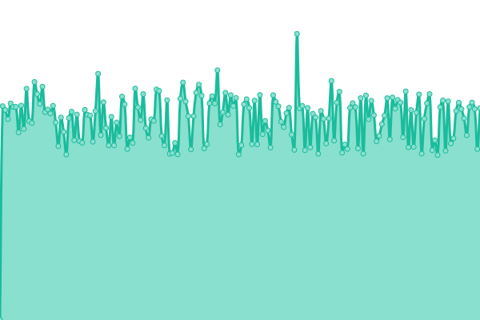

# [📈 Live Status](https://webup.navadhiti.com): <!--live status--> **🟩 All systems operational**

This repository contains the open-source uptime monitor and status page for [NavaDhiti Solutions](https://navadhiti.com), powered by [Upptime](https://github.com/upptime/upptime).

With [Upptime](https://upptime.js.org), you can get your own unlimited and free uptime monitor and status page, powered entirely by a GitHub repository. We use [Issues](https://github.com/Navadhiti/upptime/issues) as incident reports, [Actions](https://github.com/Navadhiti/upptime/actions) as uptime monitors, and [Pages](https://webup.navadhiti.com) for the status page.

<!--start: status pages-->
<!-- This summary is generated by Upptime (https://github.com/upptime/upptime) -->
<!-- Do not edit this manually, your changes will be overwritten -->
<!-- prettier-ignore -->
| URL | Status | History | Response Time | Uptime |
| --- | ------ | ------- | ------------- | ------ |
|  [Varitra](https://varitra.com) | 🟩 Up | [varitra.yml](https://github.com/navadhiti/upptime/commits/HEAD/history/varitra.yml) | 

 955ms
     
 | 

<a href="https://webup.navadhiti.com/history/varitra">100.00%</a>
    

|  [BarefootEdu](https://barefootedu.com) | 🟩 Up | [barefoot-edu.yml](https://github.com/navadhiti/upptime/commits/HEAD/history/barefoot-edu.yml) | 

 1150ms
     
 | 

<a href="https://webup.navadhiti.com/history/barefoot-edu">64.38%</a>
    

|  [Navadhiti](https://navadhiti.com) | 🟩 Up | [navadhiti.yml](https://github.com/navadhiti/upptime/commits/HEAD/history/navadhiti.yml) | 

 162ms
     
 | 

<a href="https://webup.navadhiti.com/history/navadhiti">100.00%</a>
    

|  [Karunodaya](https://karunodaya.in/) | 🟩 Up | [karunodaya.yml](https://github.com/navadhiti/upptime/commits/HEAD/history/karunodaya.yml) | 

 906ms
     
 | 

<a href="https://webup.navadhiti.com/history/karunodaya">100.00%</a>
    

<!--end: status pages-->

[**Visit our status website →**](https://webup.navadhiti.com)

## 📄 License

- Powered by: [Upptime](https://github.com/upptime/upptime)
- Code: [MIT](./LICENSE) © [NavaDhiti Solutions](https://navadhiti.com)
- Data in the `./history` directory: [Open Database License](https://opendatacommons.org/licenses/odbl/1-0/)
